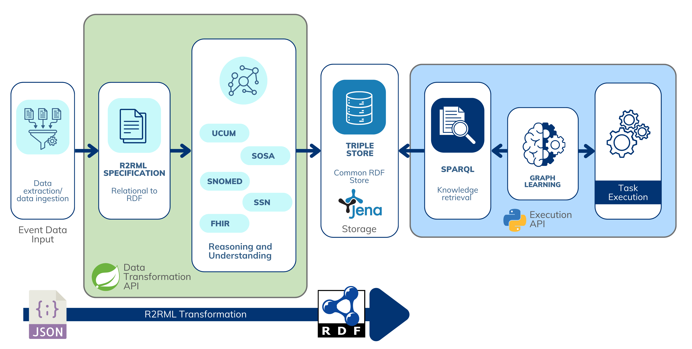

# SAFIR: A Self - Adaptive Semantic Framework for Data Interoperability in IoT and Healthcare Systems
  > **Bridging Semantic Interoperability and Adaptive Learning in Complex Systems**

## Research Overview
This repository presents a approach to enhancing self - adaptive systems(SAS) through semantic knowledge graph transformation and intelligent machine learning techniques.Our methodology addresses fundamental challenges in system adaptability by creating a flexible, semantically - rich framework for dynamic system reconfiguration.

### Research Contribution
Our work introduces an approach that:
- Enables semantic interoperability across heterogeneous data sources
  - Develops a generalizable framework for knowledge graph construction
    - Integrates machine learning for predictive system adaptation
      - Demonstrates adaptive decision - making through semantic reasoning

---

## Technical Architecture

### Workflow Components
1. **Semantic Data Transformation**
  - Ontology - driven mapping of diverse data sources
    - Semantic enrichment using standard vocabularies
- Preserving contextual information across transformations

2. **Knowledge Graph Construction**
  - Convert mapped data into structured graph representations
    - Apply semantic annotations and metadata
      - Create a flexible, interconnected knowledge base

3. **Adaptive Learning Mechanism**
  - Implement machine learning models on semantic graphs
    - Support predictive tasks:
     * Anomaly detection
  * System state prediction
    * Adaptive decision support

4. **Self - Adaptive System Integration**
  - Implement MAPE - K(Monitor - Analyze - Plan - Execute - Knowledge) loop
    - Enable dynamic system reconfiguration
      - Provide feedback - driven adaptation strategies

---

## Key Features
  - **Data Transformation:**
    - Converts raw data into RDF using RML specifications.
- Supports semantic enrichment with healthcare ontologies(e.g., SOSA, FHIR, UCUM).
- **Unified Knowledge Representation:**
  - Creates a single ontology unifying data from multiple pilot projects.
- **Graph Machine Learning Integration:**
  - Use of RDF as a graph structure for tasks like node classification, link prediction, and anomaly detection.
- **Self - Adaptive Systems Context:**
  - Demonstrates the use of RDF and Graph ML in monitoring, analysis, planning, and execution(MAPE - K loop).

---
**TODO: REVIEW FOLDERS STRUTURE**
## Repository Structure
- **`requirements/`:**Documentation for dependencies and setup.
- **`data/`:**Raw input data, RDF outputs, and graph representations.
- **`rml/`:**RML mapping scripts for standard, improved, and unified mappings.
- **`rdf/`:**RDF outputs generated from RML mappings.
- **`scripts/`:**Scripts for automating RDF generation and graph conversion.
- **`graph_ml/`:**Graph ML workflows, models, and visualizations.
- **`tests/`:**Test cases for reproducibility and validation.
- **`docs/`:**Documentation for the process and Graph ML integration.


```txt
artifact-submission/
│
├── README.md                   # Documentation for the repository
├── LICENSE                     # License information
├── requirements/               # Documentation for dependencies and setup
│   ├── dependencies.txt        # List of dependencies
│   └── installation.md         # Installation guide for tools and setup
│
├── data/                       # Input data and RDF outputs
│   ├── raw/                    # Raw input data (e.g., JSON files)
│   ├── rdf/                    # RDF representations generated from raw data
│   ├── graph/                  # Graph representations for Graph ML
│   └── results/                # Results from the workflow
│
├── rml/                        # RML mapping scripts
│   ├── standard/               # Standard RML scripts
│   ├── improved/               # Improved RML scripts with semantic enrichment
│   └── unified/                # Unified RML scripts
│
├── rdf/                        # RDF output files
│   ├── standard/               # RDF outputs from standard mappings
│   ├── improved/               # RDF outputs from improved mappings
│   └── unified/                # RDF outputs from unified mappings
│
├── scripts/                    # Automation and processing scripts
│   ├── generate_rdf.sh         # Automate RDF generation
│   ├── graph_converter.py      # Convert RDF to graph formats
│   └── run_all.sh              # Script to run the full pipeline
│
├── graph_ml/                   # Graph ML workflows
│   ├── models/                 # Graph ML models
│   ├── embeddings/             # Graph embeddings
│   ├── visualizations/         # Visualizations and results
│   └── run_graph_ml.sh         # Script to run Graph ML workflows
│
├── spring-boot-api/            # Spring Boot API for automating RDF transformation
│   ├── src/                    # API source code
│   ├── pom.xml                 # Maven build file
│   └── Dockerfile              # Dockerfile for the API
│
├── docker-compose.yml          # Docker Compose file to bootstrap dependencies
├── tests/                      # Tests for reproducibility and validation
│   ├── validation/             # Validation scripts for RDF and Graph ML
│   ├── graph_tests/            # Test cases for Graph ML
│   ├── api_tests/              # Test cases for the API
│   └── run_tests.sh            # Run all tests
│
└── docs/                       # Additional documentation
    ├── process_overview.md     # Detailed explanation of the process
    ├── api_documentation.md    # API documentation
    ├── metrics.md              # Metrics and evaluation criteria
    ├── pilot_mapping.md        # Pilot-specific mapping explanations
    ├── unified_mapping.md      # Unified ontology mapping documentation
    └── references.md           # References and external links
```

---

## MAPE - K Loop Scenario

To effectively demonstrate the use of this project we have the following scenario:

## Example Use Case: Healthcare Monitoring
  - **Scenario:**Healthcare Monitoring Monitor patient health using IoT devices and environmental data.
- **Steps:**
  1. Transform sensor data to RDF.
  2. Enrich RDF with semantic annotations and context.
  3. Build a knowledge graph.
  4. Use Graph ML to detect anomalies or predict patient risk.
  5. Trigger adaptive actions(e.g., caregiver notifications, environment adjustments).

- **Initial Context:**A patient wears a health monitoring device that collects data such as heart rate, activity levels, and environmental conditions.The smart home system also monitors fridge usage to assess eating patterns.

- **Trigger for Adaptation:**
  - The system detects a high heart rate, sedentary activity, and lack of fridge usage, which might indicate a health risk(e.g., dehydration or skipped meals).

- **Adaptation:**
  - Notify the caregiver and suggest actions(e.g., reminding the patient to drink water).
  - Adjust room temperature for comfort if environmental conditions are suboptimal.

### Monitoring

The RDF mappings will represent the data collected from the environment and other sensors:
- Input: Sensor readings from devices and user activity logs.
- Process: Convert this raw data into semantically enriched RDF using your mappings.
- Example Output:

**TODO: update with demo output**
  ```turtle
<http://example.com/environment/Disp1> a sosa:Observation;
  sosa:hasSimpleResult "30"^^ucum:beatsPerMinute;  # High heart rate
  sosa:resultTime "2024-12-01T10:00:00Z"^^xsd:dateTimeStamp .
```
### Analysis

The analysis is performed by SPARQL queries that applies reasoning into the collected data to identify potential health risks:
- Example Query: Check for high heart rate and low activity.
**TODO: update with demo output**

```sparql
SELECT ?time ?heartRate ?activity
WHERE {
  ?obs a sosa:Observation;
       sosa:hasSimpleResult ?heartRate, ?activity;
       sosa:resultTime ?time.
  FILTER(?heartRate > "100"^^xsd:integer && ?activity < "10"^^xsd:integer)
}
```

### Planning

We can use the analysis results to plan adaptive action like:
- If the query returns results, generate a notification for the caregiver.
- Plan to adjust the room temperature or suggest actions to the user.

### Execution:

At this point customized actions can be performed to execute the planned adaptation using automated actuators or notifications.
- Example: Send a message to the caregiver via email / SMS.

---
## Installation

To demonstrate the framework for this self - adaptive system scenario we have to setup the environment with the following components and dependencies:

### Prerequisites
Ensure you have the following installed:
- **Docker** and **Docker Compose**: For running the Spring Boot API, Apache Jena, and dependencies.
- **Java 17**: Required for running RMLMapper and the Spring Boot API.
- **Maven**: For building the Spring Boot API.
- **Python 3.8+**: For Graph ML workflows and required libraries:
  ```bash
  pip install networkx torch dgl matplotlib
  ```

### Setup

#### 1. **Download and Set Up RMLMapper**
RMLMapper is used for transforming data to RDF.

1. Download **RMLMapper version 7.1.2**:
   ```bash
   wget https://github.com/RMLio/rmlmapper-java/releases/download/v7.2.0/rmlmapper-7.2.0-r374-all.jar -O rmlmapper.jar
   ```

2. Move the downloaded file to the appropriate directory (e.g., `scripts/`):
   ```bash
   mv rmlmapper.jar scripts/
   ```

3. Verify the installation:
   ```bash
   java -jar scripts/rmlmapper.jar -h
   ```

   You should see the help menu for RMLMapper.

#### 2. **Start the Environment**
Use Docker Compose to bootstrap the Apache Jena Fuseki triple store, the Spring Boot API, and dependencies:
```bash
docker-compose up -d
```

#### 3. **Access the Spring Boot API**
Once the environment is up, you can interact with the API:
- **Base URL:** `http://localhost:8080/api`
- For detailed API documentation, see [docs/api_documentation.md](docs/api_documentation.md).

#### 4. **Run Graph Machine Learning Workflows**
Set up the Graph ML environment:
```bash
python -m pip install networkx torch dgl matplotlib
```

Run a Graph ML model, such as node classification:
```bash
python graph_ml/models/node_classification.py
```
---

## Workflow



The workflow for the self - adaptive system scenario is as follows:

### 1. **Data Transformation**
  Run RML scripts to generate RDF from raw data:
```bash
./scripts/generate_rdf.sh rml/standard/source_a.ttl rdf/standard/source_a.ttl
```

### 2. **Semantic Enrichment**
  Use improved RML scripts with ontologies like SOSA and FHIR defined in the mappings files to enrich the RDF data:
```bash
./scripts/generate_rdf.sh rml/improved/source_a.ttl rdf/improved/source_a.ttl
```

### 3. **Graph Construction**
  Convert RDF data into a graph format for machine learning tasks:

```bash
python scripts/graph_converter.py --input rdf/improved/source_a.ttl --output data/graph/source_a.graphml
```

### 4. **Graph Machine Learning**

  Run a Graph ML task(e.g., node classification) on the generated graph:
```bash
python graph_ml/models/node_classification.py --graph data/graph/source_a.graphml
```

### 5. **Self - Adaptive System Simulation**
  Integrate Graph ML outputs into the self - adaptive process(e.g., sending alerts based on predictions).
```python
# Example Python code for adaptive actions
if prediction == "high_risk":
    send_alert("High heart rate detected. Please check on the patient.")
```

---

## Graph Machine Learning Tasks
  - **Node Classification:** Predict missing properties(e.g., risk levels for patients).
- **Link Prediction:** Infer missing relationships(e.g., correlation between activities and health metrics).
- **Anomaly Detection:** Identify unusual patterns in data.

---

## Testing

  - **RDF Validation:**

```bash
  ./tests/validation/validate_rdf.sh rdf/improved/source_a.ttl
```

  - **Graph ML Testing:**
```bash
  python tests/graph_tests/test_node_classification.py
```

## Evaluation

To evaluate the results of our implementation, we will use the following metrics and tools:

### 1. Metrics for RDF Generation and Semantic Enrichment

1. **Completeness of RDF Mappings**
  - **Metric:** Percentage of data successfully transformed into RDF.
  - **Formula:** \(\text{ Completeness } = \frac{ \text{Mapped Data Entries } } { \text{Total Data Entries } } \times 100\%\)
  - **Tool:** Compare RDF outputs against a gold standard or expected data.

2. **Semantic Accuracy**
  - **Metric:** Number of correctly applied semantic annotations(ontology terms).
  - **Formula:** \(\text{Semantic Accuracy } = \frac{ \text{Correct Semantic Annotations } } { \text{Total Annotations } } \times 100\%\)
  - **Tool:** Manual or automated ontology validation tools(e.g., Protégé, SHACL validation).

3. **Query Performance**
  - **Metric:** Time to execute SPARQL queries.
  - **Formula:** \(\text{Query Time(ms) } = \text{Execution End Time } - \text{Execution Start Time } \)
  - **Tool:** SPARQL query logs from Apache Jena Fuseki or another RDF triple store.

### 2. Metrics for Graph Machine Learning

1. **Node Classification**
  - **Metrics:**
    - **Accuracy:** \(\text{ Accuracy } = \frac{ \text{Correct Predictions } } { \text{Total Nodes } } \)
    - **Precision, Recall, and F1 - Score:** Use a confusion matrix to calculate these metrics.

2. **Link Prediction**
  - **Metrics:**
    - **AUC:** Measures how well the model distinguishes between existing and non - existing links.
    - **P@K:** Percentage of correctly predicted links in the top \(K\) predictions.

3. **Graph Embedding Quality**
  - **Metrics:**
    - **Node Similarity:** Compare embedding distances for nodes that should be similar.
    - **Clustering Coefficient:** Evaluate whether embeddings group similar nodes together effectively.

4. **Anomaly Detection**
  - **Metrics:**
    - **TPR:** Percentage of correctly detected anomalies.
    - **FPR:** Percentage of incorrectly flagged normal instances as anomalies.

### 3. Metrics for Self - Adaptive Systems(SAS)

1. **Adaptation Accuracy**
  - **Metric:** Percentage of correct adaptations triggered by the system.
  - **Formula:** \(\text{Adaptation Accuracy } = \frac{ \text{Successful Adaptations } } { \text{Total Triggered Adaptations } } \times 100\%\)

2. **Decision Latency**
  - **Metric:** Time taken to detect a condition, analyze it, and execute the adaptation.
  - **Formula:** \(\text{ Latency(ms) } = \text{Adaptation End Time } - \text{Condition Detection Time } \)

3. **System Stability**
  - **Metric:**Number of successful adaptation cycles without system failures.
  - **Formula:** \(\text{ Stability } = \frac{ \text{Stable Cycles } } { \text{Total Cycles } } \times 100\%\)

4. **User Satisfaction**
  - **Metric:** User feedback on the effectiveness and relevance of adaptations.
  - **Tool:** Surveys or usability studies.

### 4. Combined Metrics for Workflow Evaluation

1. **End - to - End Efficiency**
  - **Metric:** Time taken to process data from ingestion to adaptation.
  - **Formula:** \(\text{Total Processing Time } = \text{Adaptation Execution Time } - \text{Data Ingestion Time } \)

2. **Knowledge Utility**
  - **Metric:** Percentage of adaptations or decisions that directly benefit system goals.
  - **Formula:** \(\text{ Utility } = \frac{ \text{Beneficial Adaptations } } { \text{Total Adaptations } } \times 100\%\)

### 5. Tools and Frameworks for Evaluation

1. **RDF and Ontology Metrics:**
  - Apache Jena Fuseki for SPARQL query timing.
  - Protégé for ontology validation.
  - SHACL for shape constraint validation.

2. **Graph ML Metrics:**
  - PyTorch Geometric or DGL for evaluating ML models.
  - Scikit - learn for calculating classification metrics.

3. **SAS Metrics:**
  - Custom monitoring scripts for tracking adaptation accuracy and latency.
  - Survey tools for user satisfaction.

### 6. How to Present Metrics in the Repository

1. **Metrics Documentation:**
  - Include a `docs/metrics.md` file explaining the metrics, their formulas, and how they are calculated.

2. **Scripts for Metrics:**
  - Add evaluation scripts to the `tests/` folder to automate the calculation of metrics.

3. **Results Report:**
  - Provide a `results/` folder containing examples of metrics calculated on your sample data.
  - Include visualizations(e.g., graphs, tables) to summarize results.

---

## Limitations and Future Work
  - Current implementation is a proof - of - concept
    - Future research directions:
  * Scalability improvements
  * Generalization across more domains
    * Advanced machine learning architectures

---

# References

## Mapping and Data Transformation

### Resource Description Mapping
  - **RML(Resource Description Mapping Language)**
  - **Documentation**: [RML Official Documentation](https://rml.io/docs/)
    - Comprehensive guide for mapping heterogeneous data sources to RDF

      - **R2RML and Mapping Extensions**
  - **Paper**: "R2RML-F: Towards Sharing and Executing Domain Logic in R2RML Mappings"
  - **Author**: Chr.De Bruyne et al.
    - **Link**: [Preprint PDF](https://chrdebru.github.io/papers/2016-ldow-preprint.pdf)
    - **Key Focus**: Extending R2RML mappings to support domain - specific logic and reusability

## Semantic and Ontological Resources

### Ontology Design
  - **DOLCE Ultra Lite(DUL)**
  - **Ontology Link **: [DUL Ontology](http://www.ontologydesignpatterns.org/ont/dul/DUL.owl#)
    - Foundational ontology for knowledge representation

### Semantic Sensor Networks
  - **SOSA(Sensor, Observation, Sample, Actuator)**
  - **Namespace **: [SOSA Ontology](http://www.w3.org/ns/sosa)

- **SSN(Semantic Sensor Network)**
  - **Specification**: [SSN Ontology](https://www.w3.org/TR/vocab-ssn/)
    - Comprehensive ontology for describing sensors, observations, and related concepts

### Healthcare Interoperability
  - **FHIR(Fast Healthcare Interoperability Resources)**
  - **RDF Specification**: [FHIR RDF Documentation](https://build.fhir.org/rdf.html)
    - Standard for exchanging healthcare data with RDF support

### Measurement and Standardization
  - **UCUM(Unified Code for Units of Measure)**
  - **Data Reference**: [UCUM Data](https://download.hl7.de/documents/ucum/ucumdata.html)
    - Standardized representation of units and codes

---

## License
This repository is licensed under the[License](LICENSE).
