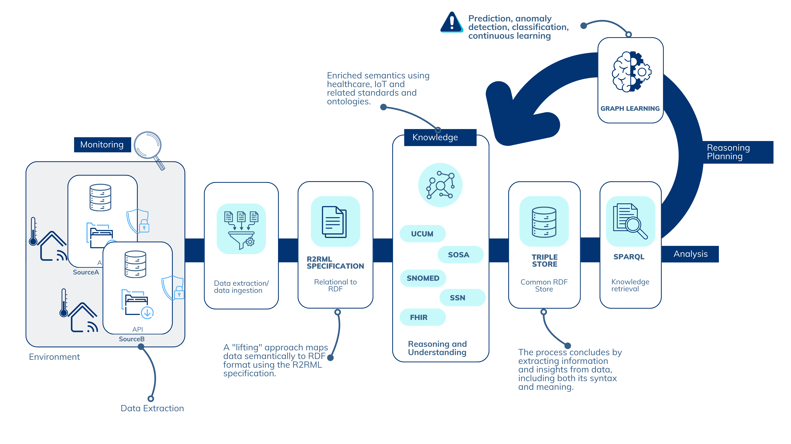

# SAFIR: A Self-Adaptive Semantic Framework for Data Interoperability in IoT and Healthcare Systems based on Graph Learning
  > **Bridging Semantic Interoperability and Adaptive Learning in Complex Systems**

## Research Overview
This repository presents a approach to enhancing self - adaptive systems(SAS) through semantic knowledge graph transformation and intelligent machine learning techniques. Our methodology addresses fundamental challenges in system adaptability by creating a flexible, semantically - rich framework for dynamic system reconfiguration.

### Research Contribution
Our work introduces an approach that:
- Enables semantic interoperability across heterogeneous data sources
- Develops a generalizable framework for knowledge graph construction
- Integrates machine learning for predictive system adaptation
- Demonstrates adaptive decision - making through semantic reasoning

---

## Technical Architecture



## Key Features
  - **Data Transformation:**
    - Converts raw data into RDF using RML specifications.
    - Supports semantic enrichment with healthcare ontologies(e.g., SOSA, FHIR, UCUM).
- **Unified Knowledge Representation:**
  - Creates a single ontology unifying data from multiple data sources.
- **Graph Machine Learning Integration:**
  - Use of RDF as a graph structure for tasks like node classification, link prediction, and anomaly detection.
- **Self - Adaptive Systems Context:**
  - Demonstrates the use of RDF and Graph ML in monitoring, analysis, planning, and execution(MAPE - K loop).

---

## Repository Structure

```txt
artifact-submission/
│
├── README.md                   # Documentation for the repository
├── LICENSE                     # License information
├── requirements/               # Documentation for dependencies and setup
│   └── dependencies.txt        # List of dependencies
│
├── data/                       # Input data and RDF outputs
│
├── rml/                        # RML mapping scripts
│
├── rdf/                        # RDF output files
│
├── scripts/                    # Automation and processing scripts
│   └── generate_rdf.sh         # Automate RDF generation
│
├── docker-compose.yml          # Docker Compose file to bootstrap dependencies
├── tests/                      # Tests for reproducibility and validation
│   ├── validation/             # Validation scripts for RDF and Graph ML
│   ├── graph_tests/            # Test cases for Graph ML
│   ├── api_tests/              # Test cases for the API
│   └── run_tests.sh            # Run all tests
│
├── src/                        # Source code for the Spring Boot API and Graph Learning Demo Notebook
│   ├── RelationalToRDFAPI/     # Spring Boot API for automating RDF transformation
│   ├── graph-learning-demo/    # Graph ML workflows, models, and visualizations
│   └── notebooks/              # Jupyter notebooks for Graph ML demos
└── docs/                       # Additional documentation and assets
```

---

## MAPE - K Loop Scenario

To demonstrate the use of this project we have the following scenario:

## Example Use Case: Healthcare Monitoring
- **Scenario:** Healthcare Monitoring Monitor patient health using IoT devices and environmental data.
- **Steps:**
  1. Transform sensor data to RDF.
  2. Enrich RDF with semantic annotations and context with R2RML mapping scripts.
  3. Build a knowledge graph.
  4. Use Graph ML to detect anomalies or predict patient risk.
  5. Trigger adaptive actions(e.g., caregiver notifications, environment adjustments).

- **Initial Context:** A patient wears a health monitoring device that collects data such as heart rate, activity levels, and environmental conditions.The smart home system also monitors fridge usage to assess eating patterns.

- **Trigger for Adaptation:**
  - The system detects a high heart rate, sedentary activity, and lack of fridge usage, which might indicate a health risk(e.g., dehydration or skipped meals).

- **Adaptation:**
  - Notify the caregiver and suggest actions(e.g., reminding the patient to drink water).
  - Adjust room temperature for comfort if environmental conditions are suboptimal.

### Monitoring

The RDF mappings will represent the data collected from the environment and other sensors:
- Input: Sensor readings from devices and user activity logs.
- Process: Convert this raw data into semantically enriched RDF using your mappings.
- Example Output:

```turtle
@prefix dcat: <http://www.w3.org/ns/dcat#> .
@prefix dcterms: <http://purl.org/dc/terms/> .
@prefix fhir: <http://hl7.org/fhir/> .
@prefix hultig: <http://hultig.ubi.pt/ontology/source_a#> .
@prefix prov: <http://www.w3.org/ns/prov#> .
@prefix ql: <http://semweb.mmlab.be/ns/ql#> .
@prefix rml: <http://semweb.mmlab.be/ns/rml#> .
@prefix rr: <http://www.w3.org/ns/r2rml#> .
@prefix schema: <http://schema.org/> .
@prefix sosa: <http://www.w3.org/ns/sosa/> .
@prefix ucum: <http://unitsofmeasure.org/> .
@prefix void: <http://rdfs.org/ns/void#> .
@prefix xsd: <http://www.w3.org/2001/XMLSchema#> .

<http://hultig.ubi.pt/ontology/source_a/actuator/act_001> a sosa:Actuator;
  sosa:isHostedBy <http://hultig.ubi.pt/ontology/source_a/device/dev_001> .

<http://hultig.ubi.pt/ontology/source_a/platform/ui_001> a sosa:Platform;
  sosa:hosts <http://hultig.ubi.pt/ontology/source_a/actuator/act_001>, <http://hultig.ubi.pt/ontology/source_a/sensor/sens_001>;
  sosa:isHostedBy <http://hultig.ubi.pt/ontology/source_a/device/dev_001> .

<http://hultig.ubi.pt/ontology/source_a/sensor/sens_001> a sosa:Sensor;
  fhir:Device.identifier "sens_001";
  sosa:hasSimpleResult "35.0"^^ucum:unit;
  sosa:isHostedBy <http://hultig.ubi.pt/ontology/source_a/device/dev_001> .

<http://hultig.ubi.pt/ontology/source_a/sensormeasurementevent/evt_001> a sosa:Observation;
  fhir:Device.owner <http://hultig.ubi.pt/ontology/source_a/sensor/sens_001>;
  fhir:Patient.identifier "usr_002";
  sosa:hasSimpleResult "28.7"^^ucum:Cel;
  sosa:observedProperty sosa:Property_Temperature;
  sosa:resultTime "2021-09-29T11:19:11.788Z"^^xsd:dateTime .

<http://hultig.ubi.pt/ontology/source_a/sensormeasurementevent/evt_002> a sosa:Observation;
  fhir:Patient.identifier "usr_003";
  sosa:hasSimpleResult "38.24"^^ucum:Percent;
  sosa:madeBySensor <http://hultig.ubi.pt/ontology/source_a/sensor/sens_002>;
  sosa:observedProperty sosa:Property_Humidity;
  sosa:resultTime "2024-06-01T00:00:00.000Z"^^xsd:dateTime .
```
### Analysis

The analysis is performed by SPARQL queries that applies reasoning into the collected data to identify potential health risks:
- Example Query: Check for high heart rate and low activity.

```sparql
PREFIX sosa: <http://www.w3.org/ns/sosa/>
PREFIX fhir: <http://hl7.org/fhir/>
PREFIX ucum: <http://unitsofmeasure.org/>
PREFIX xsd: <http://www.w3.org/2001/XMLSchema#>

SELECT ?observation ?result ?property ?resultTime ?sensor ?patient
WHERE {
  ?observation a sosa:Observation ;
               sosa:hasSimpleResult ?result ;
               sosa:observedProperty ?property ;
               sosa:resultTime ?resultTime .
               
  OPTIONAL { ?observation sosa:madeBySensor ?sensor . }
  OPTIONAL { ?observation fhir:Patient.identifier ?patient . }
}
ORDER BY ?resultTime
```


### Planning

We can use the analysis results to plan adaptive action like:
- If the query returns results, generate a notification for the caregiver.
- Plan to adjust the room temperature or suggest actions to the user.

### Execution:

At this point customized actions can be performed to execute the planned adaptation using automated actuators or notifications.
- Example: Send a message to the caregiver via email / SMS.

### Knowledge:
- The feedback from the execution phase can be used to update the knowledge graph and improve future decision-making processes.
- The system can learn from past actions and outcomes to refine its adaptive strategies.
- The Semantic Framework for Data Interoperability in IoT and Healthcare Systems provides an approach to integrating semantically technologies events and machine learning.
---

## Installation

To demonstrate the framework for this self - adaptive system scenario we have to setup the environment with the following components and dependencies:

### Prerequisites
Ensure you have the following installed:
- **Docker** and **Docker Compose**: For running the Spring Boot API, Apache Jena, and demo notebook with its dependencies.

Without the docker environment, you can run the Spring Boot API and the notebook separately.
- **Java 17**: Required for running RMLMapper and the Spring Boot API.
- **Maven**: For building the Spring Boot API.
- **Python 3.8 +**: For Graph ML workflows and required libraries:
  - PyTorch Geometric
  - Scikit - learn
  - NetworkX
  - Matplotlib

### Setup

#### 1. **Download and Set Up RMLMapper**
RMLMapper is used for transforming data to RDF.

1. Download **RMLMapper version 6.5.1**:
```bash
wget wget https://github.com/RMLio/rmlmapper-java/releases/download/v6.5.1/rmlmapper-6.5.1-r371-all.jar -O rmlmapper.jar
```

2. Move the downloaded file to the appropriate directory(e.g., `scripts/`):
```bash
mv rmlmapper.jar scripts/
mv rmlmapper.jar src/RelationalToRDFAPI/src/main/resources/jar/
```

3. Verify the installation:
```bash
java -jar scripts/rmlmapper-6.5.1-r371-all.jar -h
```

You should see the help menu for RMLMapper.

#### 2. **Start the Environment**
Use Docker Compose to bootstrap the Apache Jena Fuseki triple store, the Spring Boot API, and the notebook that demonstrates Graph ML workflows.

```bash
# src/
docker-compose up -d --build # Build and start the services
```

This command will start the following services:
- **Apache Jena Fuseki**: Triple store for storing RDF data.
- **Spring Boot API**: RESTful API for R2RML mapping and RDF generation from JSON data.
- **Jupyter Notebook**: Graph ML demo notebook that showcases node classification and link prediction tasks from RDF data.

To stop the services, run:
```bash
docker-compose down
```

With the services running, you can proceed with the following steps to interact with the API and the notebook:
- **Access the Spring Boot API**: `http://localhost:8080/swagger-ui.html`
- **Access the Jupyter Notebook**: `http://localhost:8888/lab`
- **Jupyter Notebook Token**: Check the terminal output for the token to access the notebook.
- **Apache Jena Fuseki**: `http://localhost:3030`
- **Fuseki Admin**: `http://localhost:3030/dataset.html`
- **Fuseki SPARQL Endpoint**: `http://localhost:3030/ds/query`

Without docker environment you can run the Spring Boot API and the notebook separately, the dependencies for the notebook are listed in the `requirements.txt` file.

## How to Run

The following steps demonstrate how to run the Spring Boot API and the Jupyter Notebook to interact with the system:

```bash
git clone https://github.com/HULTIG/safir-self-adaptive-semantic-framework.git

cd safir-self-adaptive-semantic-framework

# Download the RMLMapper JAR
wget https://github.com/RMLio/rmlmapper-java/releases/download/v6.5.1/rmlmapper-6.5.1-r371-all.jar

mkdir src/RelationalToRDFAPI/src/main/resources/jar/

# Copy the JAR to the appropriate directories
mv rmlmapper-6.5.1-r371-all.jar src/RelationalToRDFAPI/src/main/resources/jar/

# Start the environment - it will take some time to build the services for the first time due to dependencies
docker-compose -f src/docker-compose.yaml up -d --build

# Access the Spring Boot API
curl http://localhost:8080/swagger-ui.html

# Access the Jupyter Notebook by copying the token from the terminal output of the notebook service
docker ps --filter "name=notebook" --format "{{.ID}}" | xargs -I {} docker logs {} | grep ?token
```

> **NOTE**: The current implementation uses a simulated environment with artificial data. For real-world scenarios, you can replace the data sources with actual IoT devices, sensors, and healthcare systems data consedring data privacy and regulations concerns.

After setting up the environment, it should be available the demo notebook and the Spring Boot API to interact with the process flow.


Notebook Demo
---

TODO: Add video demo

To test the rml mappings and the RDF generation you can run the following commands:

```bash
# Make sure the rmmlapper is downloaded and placed in the correct directory
wget https://github.com/RMLio/rmlmapper-java/releases/download/v6.5.1/rmlmapper-6.5.1-r371-all.jar

mv rmlmapper-6.5.1-r371-all.jar scripts/

# Run the script to generate the RDF
chmod +x scripts/generate_rdf.sh

# Base RML mapping script
scripts/generate_rdf.sh rml/source_a/source_a_rml.ttl rdf/input.ttl

# Semantically Improved RML mapping script
scripts/generate_rdf.sh rml/source_a/source_a_rml_imp.ttl rdf/source_a_rml_imp_output.ttl

# Semantically enriched RML mapping script
scripts/generate_rdf.sh rml/source_a/source_a_rml_unified.ttl rdf/output.ttl
```

## Workflow


---

## Graph Machine Learning Tasks

- **Scenario**: Predict the risk level of a patient(e.g.low, medium, high).
- **Graph Input**:
  - **Nodes**: Patients, observations, devices.
  - **Features**: Sensor readings(e.g.temperature), patient profiles.
- **Learning Task**: Train a Graph Neural Network(GNN) to classify patient risk levels based on graph structure and features.
- **Adaptation**: Trigger notifications or alerts for high - risk patients.

This use case demonstrates how graph learning can be applied to self - adaptive systems, enabling real - time monitoring and automated decision - making in critical applications such as patient care.

---

### 2. Metrics for Graph Machine Learning

1. **Node Classification**
  - **Metrics:**
    - **Accuracy:** \(\text{ Accuracy } = \frac{ \text{Correct Predictions } } {\text{Total Nodes } } \)
    - **Precision, Recall, and F1 - Score:** Use a confusion matrix to calculate these metrics.

### 5. Tools and Frameworks for Evaluation

1. **RDF and Ontology Metrics:**
  - Apache Jena Fuseki for SPARQL query evaluation.

2. **Graph ML Metrics:**
  - PyTorch Geometric or DGL for evaluating ML models.
  - Scikit - learn for calculating classification metrics.

---

## Limitations and Future Work

The current implementation is a proof-of-concept that operates within a simulated environment using artificial data.While it demonstrates the feasibility of the approach, it has several limitations and offers opportunities for future enhancement to address more complex use cases and real-world scenarios:


| **Aspect**                                   | **Details**                                                                                                                                                      |
| -------------------------------------------- | ---------------------------------------------------------------------------------------------------------------------------------------------------------------- |
| **1. Link Prediction for Health Insights**   |                                                                                                                                                                  |
| **Scenario**                                 | Predict missing relationships, such as determining whether specific environmental factors(e.g., high temperature or humidity) affect a patient's health condition. |
| **Graph Input**                              | **Nodes:** Represent entities like patients, environmental conditions, and medical observations. **Edges:** Represent known or inferred relationships.           |
| **Learning Task**                            | Employ **link prediction algorithms** like **Node2Vec** or **GraphSAGE** to identify potential correlations or causal links.                                 |
| **Adaptation**                               | Propose adaptive measures such as adjusting room temperature or humidity to improve patient comfort or mitigate risks.                                           |
| **2. Anomaly Detection for Early Warnings**  |                                                                                                                                                                  |
| **Scenario**                                 | Detect unusual or potentially dangerous patterns in patient activity, health metrics, or environmental conditions.                                               |
| **Graph Input**                              | **Nodes:** Include patients, sensors, and health observations. **Features:** Historical data(e.g., heart rate, activity levels, environmental readings).         |
| **Learning Task**                            | Leverage **anomaly detection models** (e.g., Isolation Forests, Autoencoders) on graph embeddings to flag outliers or abnormal behaviors.                        |
| **Adaptation**                               | Alert caregivers or healthcare providers in real - time and suggest actionable interventions, such as checking on the patient or scheduling a medical evaluation. |
| **3. Data Quality and Integrity**            |                                                                                                                                                                  |
| **Challenge**                                | The accuracy and effectiveness of the process depend heavily on the quality of RDF data and graph representations.                                               |
| **Future Work**                              | Develop **automated data validation pipelines** and use **data profiling tools** to identify and correct incomplete or inconsistent records.                   |
| **Impact**                                   | Improved data quality ensures better semantic enrichment, more accurate learning, and reliable adaptations.                                                      |
| **4. Scalability**                           |                                                                                                                                                                  |
| **Challenge**                                | The current approach may not efficiently handle large - scale datasets or highly interconnected graphs.                                                          |
| **Future Work**                              | Optimize graph learning algorithms for **distributed processing** and implement techniques like **subgraph sampling** and **graph pruning**.                 |
| **Impact**                                   | Enables the system to process large, real - world datasets efficiently, supporting diverse use cases.                                                            |
| **5. Explainability and Trust**              |                                                                                                                                                                  |
| **Challenge**                                | Graph learning models often operate as black - box systems, making it difficult to trust or understand predictions.                                              |
| **Future Work**                              | Integrate **explainable AI(XAI)** techniques and provide **human - readable explanations** for predictions and suggested adaptations.                          |
| **Impact**                                   | Enhances user trust and facilitates informed decision - making by healthcare professionals.                                                                      |
| **6. Integration with Real - World Systems** |                                                                                                                                                                  |
| **Challenge**                                | The simulated environment lacks integration with actual IoT devices, healthcare systems, and real - world data streams.                                          |
| **Future Work**                              | Connect the workflow to live data feeds from IoT sensors, medical devices, and EHR systems.Implement **real - time processing** to enable dynamic adaptations.   |
| **Impact**                                   | Makes the system deployable in practical settings, such as smart homes, hospitals, and elderly care facilities.                                                  |
| **7. Domain - Specific Customization**       |                                                                                                                                                                  |
| **Challenge**                                | The approach is general and may require customization to address domain - specific needs.                                                                        |
| **Future Work**                              | Develop specialized ontologies and domain - specific graph models for various sectors, such as cardiovascular health or mental health monitoring.                |
| **Impact**                                   | Enhances the system's adaptability and relevance across diverse healthcare and IoT applications.                                                                 |

---

# References

## Mapping and Data Transformation

### Resource Description Mapping
  - ** RML(Resource Description Mapping Language) **
  - ** Documentation **: [RML Official Documentation](https://rml.io/docs/)
    - Comprehensive guide for mapping heterogeneous data sources to RDF

      - ** R2RML and Mapping Extensions **
  - ** Paper **: "R2RML-F: Towards Sharing and Executing Domain Logic in R2RML Mappings"
  - ** Author **: Chr.De Bruyne et al.
    - ** Link **: [Preprint PDF](https://chrdebru.github.io/papers/2016-ldow-preprint.pdf)
    - ** Key Focus **: Extending R2RML mappings to support domain - specific logic and reusability

## Semantic and Ontological Resources

### Ontology Design
  - ** DOLCE Ultra Lite(DUL) **
  - ** Ontology Link **: [DUL Ontology](http://www.ontologydesignpatterns.org/ont/dul/DUL.owl#)
    - Foundational ontology for knowledge representation

### Semantic Sensor Networks
  - ** SOSA(Sensor, Observation, Sample, Actuator) **
  - ** Namespace **: [SOSA Ontology](http://www.w3.org/ns/sosa)

- ** SSN(Semantic Sensor Network) **
  - ** Specification **: [SSN Ontology](https://www.w3.org/TR/vocab-ssn/)
    - Comprehensive ontology for describing sensors, observations, and related concepts

### Healthcare Interoperability
  - ** FHIR(Fast Healthcare Interoperability Resources) **
  - ** RDF Specification **: [FHIR RDF Documentation](https://build.fhir.org/rdf.html)
    - Standard for exchanging healthcare data with RDF support

### Measurement and Standardization
  - ** UCUM(Unified Code for Units of Measure)**
  - ** Data Reference **: [UCUM Data](https://download.hl7.de/documents/ucum/ucumdata.html)
    - Standardized representation of units and codes

---

## License
This repository is licensed under the[License](LICENSE).
